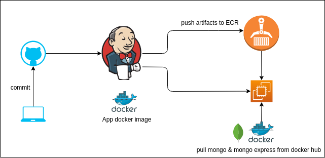

# Notes App 
#### Simple notes app with nodejs and mongo db


[Test app on your 💻 ](#test-app-on-local-machine)



- Build app image from Dockerfile
- Upload image to privet repo on ECR
- Run all containers using docker-compose

----
## Test app on local machine
### Make sure you have installed
- docker
- docker-compose
- nodejs
- npm

#### Start by running the following command in the terminal:
```bash
docker-compose -f docker-compose-local.yaml up
```
##### this will pull mongo db , mongo express from docker hub and build container form Dockerfile and start the app.

#### remove container
```bash
docker-compose -f docker-compose-local.yaml down
```

Then point your browser to http://localhost:3000

### Upload app image to ECR 
- Create a new repository in AWS ECR and name it notes-app
- Docker login to AWS ECR

```bash
#  login to your aws account
aws configure  
aws ecr get-login-password --region us-east-1 | docker login --username AWS --password-stdin 052124447099.dkr.ecr.us-east-1.amazonaws.com

```
- Build image from Dockerfile

```bash
docker build -t notes-app .
```

- Push image to AWS ECR

```md
docker tag notes-app:latest <repo-url>/notes-app:latest
docker push <repo-url>
```

Replace  in docker-compose.yaml with the image url 

```yaml
 notes_app:
    image: 052124447099.dkr.ecr.us-east-1.amazonaws.com/notes_app:latest
    ports:
      - 80:3000
```

## Automate deployment
- ### Deploy artifacts to **ECR** repository on AWS
- ### Use Jenkins as CI/CD tool

